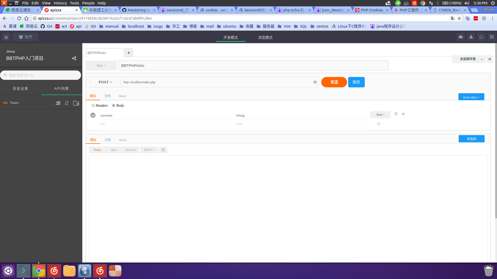

# PHP入门简介 #
Author:陈泽锋

## 一、访问网页流程简述 ##
### 1.基本概念 ###
* 服务器： 可以看做是一台在运行的电脑（永久保持开机），通过搭建环境（安装软件）来达到用户能够访问该电脑，并为用户提供**服务**（网页，下载文件，上传文件),由于图形界面占用电脑很多资源，所以为了性能，一般是采用命令行界面操作 Ps：服务器服务器，就是给他人提供服务的机器
* 域名,ip,dns: 
	* ip:一般来讲，一台电脑可以上网都有一个专门的ip地址（如199.193.23.24),别人可以通过这个ip地址来访问你的电脑，每台联网的计算机通过ip地址来互相区分，互相联系
	* 域名:ip地址是数字标识，难以记忆，于是伟大的先驱们又发明了域名（例如：www.baidu.com ），一个域名绑定了一个ip（多个域名可以绑定拖一个ip），这样就可以通过域名来识别和访问服务器了
	* dns：从机器的角度来讲，只能识别数字（0,1），所以在域名和ip之间需要转化（域名解析），域名解析需要有专门的域名解析服务器来完成，snd就是域名解析的服务器
* linux:  一种操作系统（window也是一种操作系统），由于linux*开源免费*，所以很多服务器都是选择linux（当然也有各种方面的原因了！）
* 协议：也许你第一看这个名词，可能会想到那种双方签订的协议，这并不是那么相似，这里的协议是网络协议的意思，是通信计算机双方必须共同准守的约定。举个例子，英语，如果没有语法，语义之类的约定/标准，每个人都有自己的语法，那即使面对面交流，也是双方都是一脸懵逼，不知道对方在讲什么。计算机之间的交流（你计算机打开浏览器访问百度网站，也是计算机之间的交流）需要一套标准，由专门的人维护，这套标准称之为协议。学网页常见的的协议是http协议，http协议是基于tcp/ip协议。如果你想更多的了解网络世界的概念，《计算机网络》这本书推荐看看
*  数据包（package）：


### 2.流程 ###
ps：这里以浏览器访问百度首页来介绍，只是粗略的介绍流程，具体的很多细节都需要以后你们慢慢了解，深入分析
1. 域名解析：
打开浏览器，输入 www.baidu.com 回车，电脑会先在本地hosts文件查询有没有www.baidu.com指向哪个ip，（host文件就是保存域名与ip的映射），如果有，就将域名转为ip，来发送数据包，如果本地找不到，就会向dns服务器查询，查到就将域名转化为ip，查不到浏览器就会返回错误。ps：你可以直接在浏览器输入ip，这样浏览器便不会进行域名解析
2. 发送请求：
当电脑获取到ip时，就会根据ip向服务器发送数据包，请求一个文件，如果服务器存在该文件，就访问这个文件，在本例子中，会访问一个页面（其实在发送http数据包时，会先进行tcp/ip三次握手，确保计算机之间的连接正确，具体可以自行百度谷歌查询）
3. 浏览器渲染：
浏览器获取到返回的文件（html），会利用自己的内核，分析文件，去渲染出一个页面，由此你就可以看到一个百度首页

### 3.附带 ###
* 数据的传递:
那么问题来了，在c++中，你可能会编写程序，根据不同的参数在控制台显示不同的信息，那么在你访问服务器同一个文件的时候，是否也可以根据不同参数来返回不同的信息呢？答案当然是可以的,你在编写程序(js)，可以控制在发送数据包里带各种各样的参数，而php文件可以根据参数的不同来返回不同的结果。
* 制定接口:
前后端分离，前端（js，html，css）和后台（php，mysql）商量好我发送什么参数，你传回什么格式的数据(称之为定好接口)，然后前后端各自开发自己的部分，最后再合并一起，测试
* 多线程处理请求
要是很多人访问同一个页面（比如教务系统选课抢课），都是访问同一个文件（页面），每个学生用不同电脑登录，页面会根据你的登录账号不同来显示不同信息，这里为什么呢？一个文件能够同时处理那个多的访问吗？不会造成返回信息混乱吗？ 原因在与你搭建的环境（wamp/Wnmp之类）中的http服务器会针对每一个不同电脑开一个线程，不同线程独立运行，不会互相干扰
--------------------------------------------------------------------------------

# php介绍 #
ps:基本语法直接上[W3school](http://www.w3school.com.cn/index.html)学习,或者在[慕课网](http://www.imooc.com/)看视频学习，看个人喜好
ps:个人对php后台看法：数据包/请求传来->  接受参数 -> 验证参数 -> 根据参数处理数据（对数据库操作，进行逻辑上的数据处理）-> 返回数据
* 获取参数

一般来说，前端比较常用的请求方式有２种，get 和　post ,而php可以直接获取这些请求方式的变量,可以在[php超全局变量](http://www.w3school.com.cn/php/php_superglobals.asp)学习
```php
//demo
<?php 
// post
if(isset($_POST["username"])){
    if($_POST["username"] == "")
        echo "用户名不准为空";
    else{
        ....
        ....
    }
}else{
    echo "POST请求没有传入username变量"
}
// get 
if(isset($_GET["username"])){
	......
}else{
	echo "GET请求没有传入username变量";
}
//其他的类似

//打印数组参数
print_r($_POST); // 打印POST数组
var_dump($_POST);  // 打印出POST数组
```

* 验证参数

一句话，永远不要相信前端传来的数据（数据包可以模拟，可以被截取，修改，变量内容可以被修改）
验证参数根据定下的接口来进行验证，过滤，防空，关于语法可以上www.w3school.com去学习
* 处理数据

好像没什么可以说的了，根据需求来处理
* 返回数据

比较常用的数据传递格式的是json，json可以把数组转化为字符串返回给前端
ps：echo是输出字符串到浏览器，return是终止后面代码的执行并返回一个值，所以在实际传送数据时都是return，php和web服务器会自动帮你respond包，echo更多是在测试时候方便调试


```php
<?php
//  一系列操作
$arr = [];  // $arr = array();写法也可以，不过比较长
$arr["username"] = "studyPHP";
$arr["status"] = "1";
$arr["sex"] = "男";
//echo  $arr;  错误写法，echo 数组是错误的，
//var_dump($arr); 用于调试，直接输出数组内容到浏览器
return josn_encode($arr);

```

* 问题：

	* 上面我们说过了，很多人访问同一个网页，web服务器（apache，nginx等）会自动帮你新开一个线程，那么服务器是如何在众多线程中识别不同用户操作呢？
	答:服务器对新来的请求开一个线程（或者说session，也叫会话），会生成一个sessionId，这个sessionId会随数据包发送到你的浏览器，你的浏览器会保存起来，当每次访问这个网站的任何网页时，浏览器都会自动的帮你把sessionId发出去，服务器根据这个id找到属于你的线程
	* http协议是无状态协议，不会记录你的所有操作，就像你每次运行c++程序一样，下一次的运行并不会读取上一次你设置的变量的值，那么，当我登录后，一直的操作，服务端是如何一直记录我的信息呢
	答：php有个全局变量$_SESSION, 通过设置这个全局变量，服务端可以每一次都读取，改变这个变量，并影响下一次请求（这里有个注意，sessionId是用来识别线程，而$_SESSION变量是服务器分配到该线程后起作用的。举个例子
	```php
	<?php
	session_start();  // 必须，告诉服务器你想启动session
	$_SESSION["username"] = $_POST["name"];  // 将post请求中的name变量内容设置为SESSION
	echo $_SESSION["username"];
	//  如果A电脑登录，post一个name变量为 A，同时，B电脑登录，post一个变量为 B，那么，A，B电脑浏览器会输出什么呢？看起来都是输出
	$_SESSION["name"], 可是A电脑输出 A ，B电脑输出 B。为什么？ 因为你访问网页时，sessionId已经传输到你浏览器，以后你的每次请求，
	都会分配到独立的线程，而独立的线程的SESSION变量不会影响

	```
	除session之外，还有一个cookie，与session这种保存变量在服务器上，cookie是保存在浏览器中，当你访问某个网站时，浏览器会在本地一个 特定的文件夹中查找有没有这个网站的所有cookie，有的话，就全部一起跟随数据包发送到服务端，而服务端通过$_COOKIE来获取你传的cookie，这也可以用来保存用户信息，可以用来减少服务端的资源开销
* 开发工具

	* 当你想后台快速开发时，一款模拟发包软件（根据你填些的数据来模拟前端发送给后台的http数据包）是很有必要的 chrome上有一款postman的插件，可以模拟发包，很受欢迎，不过是英文版的。个人用过一段时间，后来改用一款国产的， 叫apizz（看起来像是××postman的），不过我的体验非常好，够简介，唯一不好的地方就是得手动保存修改的地方
	
	在apizza里，你可以选择是发送get还是post请求，也可以把数据放在body里面，可以自由填写键值，发送文件，对于开发 来说确实很有用，具体操作我就不说了，没有什么难度。
* 调试

	写程序当然少不了各种各样的bug了，这时候就需要调试了，常用的调试有几种：
   1. 手动打断点，直接在你想输出的地方var_dump（）变量+exit结束程序运行，在浏览器上看你的变量符不符合预期结果
   2. 仔细查看浏览器的报错，你搭建的环境应该默认是会输出php错误到浏览器的页面，没有的话得去设置下。刚开始学，
   可能对错误信息一脸懵逼，这时候就是考验英语和耐心的时候了，看多了，以后就会快多了。看完错误信息后，还不懂，就
   可以百度，google，强力安利[stackoverflow](stackoverflow.com),把错误信息粘贴在这里搜索，一般都会有正确答案的。
   3. php的扩展叫Xdebug,可以用于像vs一样打断点，不过需要自己安装，自行去百度xdebug+编辑器/ide名称查找安装吧
-----------------------------------------------
### mysql数据库介绍 ###
* 简介：

数据库，顾名思义，就是保存数据的地方，用过excel都知道，有行和列，每一列都是不同的参数（在数据库中称之为字段）， 每一行都是不同的个体（数据库中称之为一条记录），比如学生的姓名，性别，学号，都是一个个字段，而在每一行中，都有具体的学生数据。数据库中， 一个excel表格（粗暴的说法...）是一张表，一个库有多个表，一个mysql数据库可以建立多个库。而我们可以对表进行各种 各样的花式操作。比如增加/修改/删除/修改一条或者多条记录
* php操作数据库基本流程：
	* 建立数据库：

	直接用图形化界面phpmyadmin，用超级管理员root登录（默认没有密码，记得去修改），建立一个库，建立表，完成字段，在这里，有一个需要注意，数据库的编码，统一采用utf8(utf8_general_ci),这是一个大坑，字符的不同会导致乱码
	* php操作数据库
		```php
		<?php

		/* Connect to a MySQL server  连接数据库服务器 */
		$conn = mysqli_connect(
			'localhost',  /* The host to connect to 连接MySQL地址 */
			'root',       /* The user to connect as 连接MySQL用户名 */
			'', 		  /* The password to use 连接MySQL密码 */
			'dbname');    /* The default database to query 连接数据库名称*/
		if (!$conn) {
		    printf("Can't connect to MySQL Server. Errorcode: %s ", mysqli_connect_error()); // echo出来也行
			exit;
		}else{
		    echo '数据库连接上了！'. "<br/>";
			//执行mysql语句
			if ($result = mysqli_query($conn, 'SELECT id,class,scores  FROM jian_scores WHERE scores>60 ')) {
				echo('id  班级 分数 '). "<br/>";
				/* Fetch the results of the query 返回查询的结果 */
				while( $row = mysqli_fetch_assoc($result)  ){
				    echo  $row['id'], "&nbsp;", $row['class'], "&nbsp;",  $row['scores'], "<br/>";
					 // printf("%s (%s) ",  $row['id'],$row['class'], $row['scores']);
				}
				/* Destroy the result set and free the memory used for it 结束查询释放内存 */
				mysqli_free_result($result);
			}
		}


			/* Close the connection 关闭连接*/
			mysqli_close($link);
		```
	* 问题：
		* 刚入门时，mysql的错误是很多了，通常都是查不到自己预期的结果，这里就需要debug，一个解决方案是先在php中echo你要执行的mysql语句，然后复制到在phpmysqladmin的mysql执行区域执行你执行，如果没问题，证明你mysql语句没问题，有就修改语句
		* 你可以在mysql安装目录下的bin（binary，而二进制可执行文件）中进入命令行界面的mysql，在bin路径下输入语句： `mysql -u root -p` 然后输入密码，回车记录，具体的mysql命令操作，以后在补充
		* 虽然数据库图形界面操作很爽，但也不要忘记命令行操作也是很重要的，在服务器端是没有图形化的操作的（要搭建也不是不可以，不推荐），这个时候你要是想把代码部署到服务器上运行，就得亲自去命令操作mysql了。
