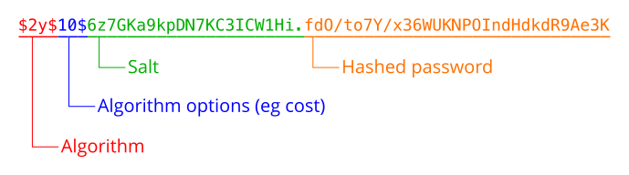

Author: [Kingsley](https://kingsleyxie.cn/talking-about-web-password-security/)

### 传输安全
我们先来看看用户密码从在输入框输入到写入数据库以及后续的验证操作会经过哪些阶段。

注册时的流程当然是前端把数据传送给服务端，然后服务端接收后进行一些处理写入数据库。验证时取出这个处理后的值，然后处理刚刚的验证请求发来的密码，最后进行比对。这里的“处理”具体是什么后面会详细讲。

这个阶段主要的安全问题在于，数据从前端发送给服务器的过程可能会被窃听。所以一般涉及密码输入的页面都强制要求使用 `HTTPS` 协议，现代的大部分浏览器也会对在非 `HTTPS` 页面上输入密码这些敏感操作给出高危提示。

有些时候会看到有网页把密码先在前端加密后再发送给服务器，感觉这个操作意义其实不大。想象一下如果加密后的数据在传输的时候被窃听了，那窃听者在伪装成用户的时候，把这个字符串同样地发送给后端，是不是还是可以达到欺骗的效果。换句话讲，对后端服务器而言，无论传输过来的密码实际上是否有进行加密，都只是它后续操作的原文而已。

更严重的问题是，比如客户端用非对称加密算法对密码进行加密，却忽视了公玥被中间人替换之类的安全风险，那这个加密操作也就基本形同虚设了。就是说如果传输的渠道本身就是不安全的，光靠这些信息加密操作并没有多大意义。总而言之，**Web 前端发送密码等数据给服务器这个阶段的传输安全，应该由 `HTTPS` 协议保证**，而不需要提前对某些值应用加密算法。

### 存储安全

##### 加密哈希函数
要了解接下来的内容，首先需要有一个有关“加密哈希函数”的概念。具体的定义我可能也描述不好，有兴趣的可以自己去找相关的资料，这里就列举一下它那些能被用来做加密和验证的特性：

- 对于任意长度的输入值，输出值的长度都是相同且固定的
- 对相同的输入值，输出值总是相同的
- 对哪怕相差很少的两个输入值，输出值都有非常大的差异
- 由输入值计算输出值很容易，但由输出值反推出输入值非常难
- 几乎不可能构造出输出值完全相同的两个输入

实际上，根据 [鸽巢原理](https://zh.wikipedia.org/wiki/%E9%B4%BF%E5%B7%A2%E5%8E%9F%E7%90%86)，输出值的取值域有限，而输入值的取值域可以视为无穷，还是存在产生相同输出的两个输入值的。如果对于一个加密哈希函数，可以相对容易地找到这样两个值，这个时候这个加密哈希算法当然就是不安全的了。

而第四点的“非常难”指的是，反推的时间消耗极大，大到在现实时间内无法接受，于是我们可以认为这个反推是不可能的。实际上密码学的很多安全都是基于一些数学上的难题实现的，比如 RSA 加密就基于对大整数进行因数分解的困难~~，数学真是美妙啊~~。

由此我们可以看到，对密码进行加密哈希，并将得到的结果存入数据库，后续通过同样的散列算法进行比对，即可在保证安全的前提下验证密码是否一致。

##### 逻辑实现
下面就可以进行逻辑上的实现了，基本上只要提供了加密哈希函数库的语言都可以做到，代码量也很少。使用过程中不会涉及哈希函数的构造和实现~~，而且我也不会~~，但是有一个意识必须有：正式上线使用的密码相关的函数，不要自己去实现，而应该使用身经百战的公认的代码库里的函数，否则如果实现上有问题，加密哈希的安全性就没有保证了。

我们在用户数据表里增加一个字段 `hash`，用来存储密码的哈希值。在注册操作进行时，计算好用户的密码哈希，然后存到这个字段里。在验证的时候，取出这条数据对用户名和密码进行验证。

这里顺便提一下，一般验证的时候会把“用户名不存在”和“密码错误”视为同一个错误“用户名或密码错误”，也就是不给登录者输入的账号是否存在的提示，这样在一些防范盲目攻击的时候有比较大的作用，攻击者如果不知道有哪些账号是存在的而哪些是不存在的，就可能会耗费更多的时间在尝试用户名和密码上。当然这个还是取决具体的项目场景，如果觉得有必要给登录者账号是否存在的提示的话就应该分别处理。

### 存储安全强化
这里所谈的“安全”，其实指的是在数据库泄露的情况下如何保证用户的密码不泄露。试想攻击者通过某些漏洞拿到上面的那张数据表，他真的不能由此得到用户的密码吗?

尽管加密哈希可以保证从哈希值直接反推出原文难以实现，但我们很容易想到一种方法得到部分弱密码的用户名：预先计算常见的弱密码的哈希值，再对整张表进行比对，如果有相同的值那么他们的原文一定是相同的，于是就可以得知这个用户名对应的密码，这个预先计算好的表叫做 [彩虹表](https://zh.wikipedia.org/wiki/%E5%BD%A9%E8%99%B9%E8%A1%A8)（[Rainbow table](https://en.wikipedia.org/wiki/Rainbow_table)）。

还有一个问题，同样基于“对相同的输入值，输出值总是相同的”这一特性。如果攻击者发现表中有两个密码哈希值相同，而他又掌握着其中一个人的密码，这个时候所有相同哈希值的密码就都被推知了。毕竟密码是人想出来的，为了便于记忆还是可能有一些使用相同密码的情况，而这个时候哪怕有一个人的密码没保护好，安全影响的范围就会扩大。

有没有什么办法可以保护这些密码呢？对于弱密码来说，输入时的密码强度限制当然是非常重要的一个手段，但是后端也仍然有义务做好密码安全方面的工作，所以就有了以下两种常见的强化方式。

##### salt
既然用户输入的密码太弱，我们是不是可以强行让它变强[奸笑]。比如用户输入的密码是 `123456`，我们可以在存储的时候拼接一段随机字符串比如 `f21sdsd0fsa`，然后把拼接后的串 `123456f21sdsd0fsa` 作为加密哈希函数的输入进行计算，得到的值和拼接的随机字符串一起存入数据库。

实际上，这个拼接的随机字符串有它自己的名字，叫做 `salt`，中文一般叫“盐值”。密码加盐之后就会变咸，咸了就更难破解了（逃

具体实现的时候可以有很多方式对密码进行加盐操作，前后拼接是比较简单直接的方式，还有诸如间隔插入等打乱原密码程度更高的操作，只要保证操作用上了盐值的所有位并且能复现就可以了，当然没事也别搞得太复杂，毕竟真正的安全核心不在这块，而在于加密哈希函数的安全性和盐值的长度与随机性。

就数据库储存方面而言，可以增加一个 `salt` 字段用于存储盐值，然后原来存哈希值的字段用于存加盐后的密码哈希。验证的时候同样是取出用户名对应的数据然后用这个盐值拼接输入的密码，再对比计算出的哈希值。当然也可以只使用原来的字段，把盐值和哈希值拼接后作为一个值写入数据库，反正它们是一一对应的，只要能方便完成分离和拼接就不会对业务逻辑有什么影响，注意字段的长度容量要控制好。

特别注意加盐的操作是对每个密码单独进行的，而且密码所用的盐值不能相同，如果都用同一个盐值的话对于之前提到的两个安全问题都是没有帮助的：相同的密码还是得到了相同的哈希值，而预先计算的攻击方式，由于盐值是和加盐后的哈希一起存放的，攻击者可以用这个盐值去进行预先计算的操作，和破解不加盐的攻击耗时基本相同……嗯其实准确一点说，不加盐的哈希值网上可以直接下载到一堆，配合使用不够安全的加密哈希算法的话基本和明文存是同样的危险级别，可以自己去搜索验证一下，很多网站不仅提供这类文件下载还直接提供在线破解功能。

##### pepper
考虑更极端的情况，数据库泄露了之后攻击者同时拿到了盐值和加盐后的哈希值，然后他就可以用这些数据直接强行计算一些弱密码拼接对应盐值后的哈希值进行比对，因为每个哈希值都有唯一对应的盐值。当然实际上这个计算量是很大的，除非是非常重要或者有很大商业价值的密码，一般不会有人这么做~~，留着这计算能力干点别的可能收入还更多呢~~。

为了避免这一类攻击，又出现了另一种强化的方式，叫做 pepper，不过我没找到它的中文叫什么，直译是“胡椒”我们都知道，嗯……和盐一起就是椒盐了hhh。

pepper 的基本机制和 salt 是一样的，也是通过拼接一段随机字符串来加强密码安全性。不同的地方在于，它不和加盐后的哈希一起存储，而是单独存放在一些和应用程序无关的地方，甚至可以写到硬件里面。这样的话数据库泄露后由于攻击者不能拿到 pepper 值，就不能进行预先计算之类的攻击了。

而对于从相同哈希值得知相同密码的情况，一般使用 pepper 的时候不会只有一个，而是预先生成很多个然后在计算的时候随机选择其中一个，生成哈希值存放进数据库。验证的时候需要遍历所有的 pepper 值进行拼接计算哈希，然后对比取出的哈希值，如果有匹配到就验证成功，如果一个都没匹配上就验证失败。显然 pepper 的数量太少的话还是容易有风险，而随着数量的增加计算量也会增加很多，在登录注册请求较多时会给后端带来很大压力，这个阈值要做好取舍。

可能会有人考虑再极端一点的情况，就是攻击者直接在登录页面一个个尝试弱密码，有没有可能被撞对几个。对于这种情况，除了前面提到的不提示用户名是否存在的操作以为，还有很多防护措施，比如我们平时经常看到的验证码、二次认证、手机扫码登录、不常用登录地址判断等，此外还有请求峰值限制、IP 限制之类的操作，要想从这个渠道一个个试密码，代价是非常高的。

其实攻击和防护本来也不可能做到任何一方完全主导，对于防护者来说，只能不断提高攻击的成本，而不能指望有一个完美的解决方案。就拿登录验证来说，我们必需保证正常用户登录的时候可以得到正常的处理和返回结果，那总不可能为了彻底防止攻击直接关掉登录接口吧。

##### 简单对比
先给一下 [salt](https://en.wikipedia.org/wiki/Salt_(cryptography)) 和 [pepper](https://en.wikipedia.org/wiki/Pepper_(cryptography)) 的维基百科链接，对应的中文页面前者是缺了好多内容后者是直接没有，所以还是看英文的吧。

salt 和 pepper 的基本机制比较类似，都是通过打乱和增长原密码来强化安全性。但是 salt 是关联到每个具体密码的，而 pepper 单独存放，一般不放在和项目相关的文件夹或数据库中。在使用的时候，它们都需要保证值的随机性，并且要有足够的长度和复杂度。

这两种强化方式各有自己的优缺点（好像是废话），实际使用的时候，如果是比较重要或者密码非常敏感的项目一般是要两者同时用上的。不过我自己就只用加盐一项，pepper 毕竟需要单独存放值，而且好像也比较少看到有关的资料。

### 具体实现
接下来简单讲讲关于密码加盐哈希具体的实现方式，pepper 的实现机制相差不算特别大就不提了，有兴趣的可以自己去尝试~~，主要是我也没在线上项目里用过~~。

##### 算法选择
具体实现首先要考虑的问题当然是选用什么算法了，前面也提到了有关密码安全的函数不要自己造轮子，所以这个也可以说是选用系统或语言提供的什么函数的问题。

密码学相关的内容总是需要非常严谨的，毕竟应用上去之后出现问题麻烦就大了。一般使用的算法是 SHA(Secure Hash Algorithm) 家族，它是目前很多机构和组织公认的标准，既然是家族那肯定是有很多版本的，我直接从 [维基百科](https://zh.wikipedia.org/wiki/SHA%E5%AE%B6%E6%97%8F) 上截个图：


其中的 MD5 是用作对比的，它并不是 SHA 家族里的成员。

我们可以看到右侧的“碰撞攻击”一栏给出了这些算法目前的安全性，MD5 在 1996 年后就被证实存在弱点可以被加以破解了，而 SHA-1 现在也已经出现了一些问题，它们都不应该再被视为安全的算法。

据此而言我们选择使用的算法应该至少是 SHA-2，它至少在目前还没有出现明显的可攻击弱点，我之前使用的是 SHA-256，现在推荐还是用高位一些的比如 SHA-512 之类的。

##### 盐值生成
盐值因为一般也要求定长，很容易想到直接使用哈希函数的输出值，而输入值只要是随机数就可以满足它的随机性要求了。虽然也可以直接用时间戳之类的作为盐值，但是毕竟它的值是一直增长的感觉还是不够吼，而通过限定上下限产生的随机数又是取值范围相对强哈希小一些的纯数字，不太推荐使用。

这个输出的哈希值只要长度满足我们的要求就行了，并不需要太过考虑被破解的问题，毕竟一个随机数拿到也没有什么用，至于具体选择哪个算法~~，还是看心情吧~~，我并没有找到太多相关的资料。看到一小部分说法是盐值长度要和加密哈希的最终输出长度相同，不过我个人感觉像 SHA-1 之类的输出应该就已经足够了。

##### 代码示例
下面以 PHP 为例给点简单的代码示例，直接的哈希函数有 `md5()` 和 `sha1()`等，但是在这些函数的官方文档页面也给了不要将它们用于对密码进行哈希操作的警告，还附带一个链接到详细说明有关密码哈希问题的 [文档](http://php.net/manual/en/faq.passwords.php)……嗯我感觉这个页面的内容还是很有必要看看的。

其它的哈希算法就直接都放在 `hash()` 函数里了，通过参数选择想要使用的具体算法，为了便于演示和理解这里就直接用它配合 SHA-512 进行加盐哈希，其实实现上还是有安全漏洞，具体原因后面会提及。

代码本身很简单：

```php
// Hash
$salt = sha1(mt_rand());
$hash = hash('sha512', $password . $salt);

// Verify
$curr_hash = hash('sha512', $input . $salt);
$passed = ($curr_hash === $hash);
```

前面两个结果存到数据库里，验证的时候取出再计算对比即可。

### 时序攻击
##### 问题
在比对字符串的时候，一般的做法是从前往后逐一进行比较，遇到不同的值直接中断然后返回结果。那么在字符串长度比较大的时候，前面很多位相同和第一位开始就不同的处理时间就会有区别。抛开网络请求和其它处理流程不看，仅考虑字符串验证的部分，校验时间越长就说明匹配的位数越多，攻击者于是可以通过校验时间的长短大致判断出是哪一位开始出现了不同值，然后对应进行更改并不断重复这个流程，这种做法需要的尝试次数可比盲猜少多了。


可见有时候性能太高也不见得是好事，甚至可能语言本身实现的比较并没有这个问题，但编译或解释代码的时候为了执行性能而进行了这样的优化，用到安全相关的代码上就产生漏洞了。

这种攻击方式叫做时序攻击（[Timing attack](https://en.wikipedia.org/wiki/Timing_attack)）。当然如果加上网络请求以及其它后端处理的话，这种时间差不会有太大影响，但是千万不要觉得它只是理论上存在的一种攻击方式，时序攻击的利用是有真实出现过的。

类似的手段还有比如通过对芯片能量消耗、功率曲线等数据的分析来破解需要的数据，这类攻击的总称是 [Side-channel attack](https://en.wikipedia.org/wiki/Side-channel_attack)，可以翻译为“旁路攻击”，它们的出发点不在算法本身而在其它漏洞甚至物理实现上。

说实话如果不是查资料了解到这种攻击类型的存在，我真不见得能自己意识到一个密码系统能在这种地方出现漏洞，所以安全相关的问题还是远比想象的难得多啊。我也是在这个时候理解了为什么说“涉及密码安全的大部分算法都是为密码学单独设计的”，整个系统中任何一个环节稍一疏忽就可能导致所有的努力都白费。

##### 解决方案
解决方案当然就是让字符串对比的操作耗时恒定啦，我们可以在对比操作过程中根据被对比的字符串长度定下对比时间。然后在对比操作时仅记录下状态而不要急着直接中断操作，并且保证对任意长度的输入都会进行相同次数的同类运算，到最后再返回对比结果。

注意定下的对比时间不能依赖于输入字符串的长度，因为它也是可变的。实际的实现为了方便可以要求对比的两个字符串等长，不等长的情况下直接返回 `false`，当然依靠时序攻击就可能得知哈希值的长度，不过拿到长度也没有很大用处对吧= =

很多语言的相等比较操作符和 `strcmp()` 之类的字符串比较函数都是耗时非恒定的，毕竟要考虑到语言整体的性能。但是它们也一般会提供一些专用于密码哈希值比较的库、模块或函数，一些框架里也会单独提供这些功能，像 PHP 里密码专用的哈希函数和针对时序攻击强化过的验证函数就分别是 [`crypt()`](http://php.net/manual/en/function.crypt.php) 和 [`hash_equals()`](http://php.net/manual/en/function.hash-equals.php)。

### 收尾之前
PHP 还提供了更方便使用的哈希和验证函数，就是 [`password_hash()`](http://php.net/manual/en/function.password-hash.php)和 [`password_verify()`](http://php.net/manual/en/function.password-verify.php)，前者的输出值直接涵盖加密算法、算法选项（如消耗代价）、盐值和实际哈希值，这样用一个值存储的话无论是维护还是验证都更加高效和便捷了：



设计数据库的时候同样要特别留意它的长度容量，因为这个不像我们上面演示的做法一样能保证长度一直不变，它默认是根据系统环境提供的功能多少以及当前能实现的密码算法强度等因素决定的，官方推荐的长度是“最好 255 个字符”。

对应前面的代码示例，安全一点的做法就是这样的：

```php
// Hash
$salt = sha1(mt_rand());
$hash = password_hash($password, PASSWORD_DEFAULT, ['salt' => $salt]);

// Verify
$passed = password_verify($input, $hash);
```

PHP 7.0.0 开始弃用了 `salt` 选项，也就不需要我们考虑盐值的生成问题了，它会自己用默认方式生成。所以代码就简单了更多，一行生成一行验证即可，安全性相比我们最开始的实现也有非常大的提升：

```php
// Hash
$hash = password_hash($password, PASSWORD_DEFAULT);

// Verify
$passed = password_verify($input, $hash);
```

如果稍微看过上面提到的专用于密码的函数的文档的话，就会发现它们默认不会使用 SHA 家族的函数，而是用比如 `blowfish` 之类的哈希算法。这其实和前一部分一样也是因为性能太好产生了安全问题：SHA 生成哈希结果太快了，这就导致通过枚举计算可能的取值来暴力破解的代价小了很多，所以一般会选择比较慢的哈希算法来真正应用到密码安全相关的函数里。

### 小结
我就简单谈谈我自己的看法吧，我觉得用户选择了我们的产品，我们就有义务保护好他们的数据安全，尤其是密码相关的内容，这就类似木桶效应，特别是现在很多人都在各种地方使用相同的密码的情况下，一个安全漏洞导致的密码泄露，可能会影响到这个用户的其它各种账号安全。

从另一个方面来讲，用户自己也应该尽量避免使用弱密码并保护好自己的密码安全，不能完全依靠或者说完全信任开发者的安全防护方案。

那么，了解完这些后应该也就明白为什么用到密码的网站都能验证和重置密码，却不能真正“找回”密码了，因为哪怕是数据库的管理员也没法知道密码原文究竟是什么，需要知道密码的只有用户自己。

### 题外话
这里的密码保存及验证考虑到实际需求尤其是安全性问题，使用的是单向散列函数，定长输出值的特性方便了存储结构的设计，而不能逆推的特性保证了存储后的原密码安全。有时候我们需要用到能解密的加密函数，这也是个非常有趣的话题，尤其是有关对称加密和非对称加密的原理，让人不禁啧啧称赞数学的美妙（

另一方面，除了专为密码学用途设计的这些加密哈希函数以外，还有很多的其他哈希函数。类似的单向散列函数本身也有非常多的其他用途，比如我们经常用到的文件校验机制，同样利用了它们的一些特性以保证接收的文件在传输过程种没有经过他人的篡改。

然后再次安利结城浩的《图解密码技术》，讲得非常清晰易懂而且涵盖了关于加密、摘要、认证等方面的相关技术。当然这个是科普层面的书籍，适合我这种数学不太好的人看，如果想再深入了解的话可以找点密码学相关的专业经典来看（逃

所有代码示例的整合版本都放在了 [GitHub](https://github.com/KingsleyXie/NaiveProjects/blob/master/Snippets/hash_demo.php)。
