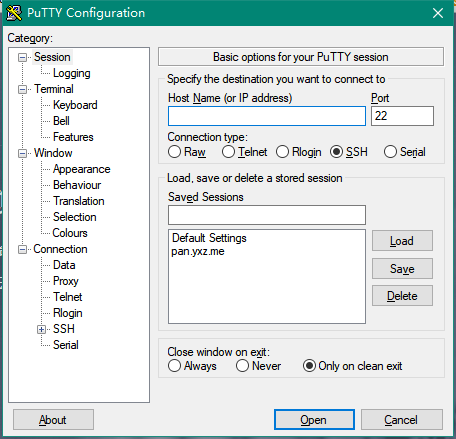
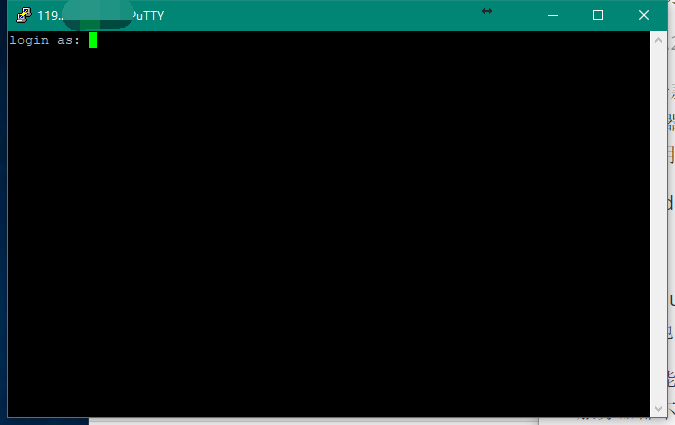
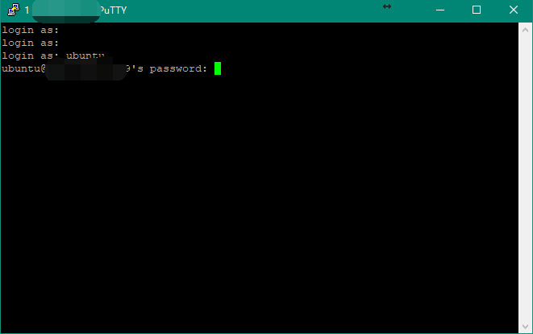
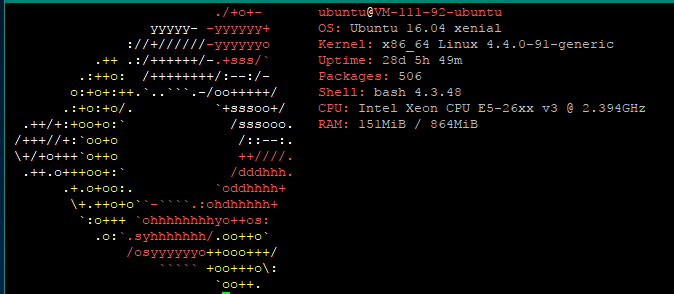

# linux初学者教程

* [1.前言](#1)
  * [1.1教程目的](#1.1)
  * [1.2摆正心态](#1.2)
  * [1.3常见的linux发行版](#1.3)
* [2.通过SSH链接到linux服务器](#2)
  * [2.1什么是终端(命令行)](#2.1)
  * [2.2使用putty登录到远程linux服务器](#2.2)
* [3.Shell](#3)
  * [3.1什么是Shell](#3.1)

<h2 id="1">1.前言</h2>
<h3 id="1.1">1.1教程目的</h3>
本教程的目标人群：从未接触过linux但是想要学会linux的一些基本操作以满足日常开发、使用需要的萌新，算是先让车跑起来吧。
所以本教程将会着重介绍一些常用到的知识与相关命令，但不太会深入去讲，但愿读者能自行谷歌查阅。

同时，建议读者在阅读本文时手头上有一台装着Linux的机器，建议租一台学生机，如[腾讯云](https://cloud.tencent.com/act/campus) [阿里云](https://promotion.aliyun.com/ntms/campus2017.html) (安装Ubuntu 16 系统即可)，也可使用[Windows Subsystem for Linux ](https://msdn.microsoft.com/en-us/commandline/wsl/install_guide) *使用wsl时请特别注意，linux子系统和windows不是完全隔离的，切勿尝试使用rm -rf / 等命令*

<h3 id="1.2">1.2摆正心态</h3>
可能很多人认为，linux只有呆板的黑底白字，是很难的，对用户一点都不友好。然而，实际上并不是这样。毕竟，linux也是人开发的，如果有使用不方便的地方，自然会有开发者去造轮子，尝试去让它变得更为易用，而且，linux已经有非常久的历史了，以往很多为了方便与机器交互而忽略人类使用体验的程序有了易用的替代品，例如 命令行操作界面的`bash shell`=>`zsh`, 命令行内的多窗口`screen`=>`Tmux`。同时，linux也是有图形操作界面，甚至比windows还要酷炫。有人可能要问，为啥有图形界面，我们还是要用命令行呢？因为，往往对用户越友好的东西，它的可扩展性越差，学完本教程之后，你会发现，通过`管道`这种东西，命令行的灵活度是图形界面完全不能达到的，例如，通过一系列的命令的简单组合，你可以立即从一堆纯文本的日记中找到你想要的信息，比如说每天第一个登录的用户，每天登录次数最多的用户等等。所以，请摆正你的心态，请勿带着一种畏惧的心态去学linux，linux是很有魅力，也是很好玩的。
<h3 id="1.3">1.3常见的linux发行版</h3>
什么是发行版：都是基于linux内核开发的系统，都有属于自己的生态，但是面向的使用场景不同。在笔者看来，就是系统自带的一套工具链不同。
下面仅列举笔者用过的linux发行版与在多年的玩鸡经验下对其的*主观*印象

* centos：Red hat的免费版本。red hat是一款面向企业的收费的linux系统，它主要的特点是自带的软件库版本非常稳定（毕竟充了钱），所以很多生产环境的服务器会用centos作为操作系统，但是软件库非常老....用起来很不舒服，笔者就不喜欢
* Debian: 非常常见的linux发行版，更新较为保守，比ubuntu省资源，一般用于服务器。笔者用于生产环境的服务器基本上用的都是debian
* Ubuntu: 感觉和Debian很类似，但是它是主要面向个人用户的，并且更新的非常激进，自带的软件库更新也很快，带有俩个分支，一个是desktop，一个是server。ubuntu的desktop版本相当于你用的windows系统，它的桌面是非常酷炫的，而且自带有非常多的日常使用的软件。server版本则主要用于服务器。笔者感觉ubuntu适合开发，笔者的开发服务器装的是ubuntu.

<h2 id="2">2.通过SSH链接到linux服务器</h2>

开始本节前手头上请务必有一台linux服务器

<h3 id="2.1">2.1什么是终端(命令行)</h3>

一般来说，我们所讲的linux终端是指用命令行形式和linux系统进行交互，也就是平常你看到别人操作linux时的那一个黑框框。那么问题来了，维护人员总不可能一直待在机器身边，那么如何远程去操作系统呢？这时候，就有Telnet(22端口)这种东西了，他是用来远程登录服务器的一种协议，但是他是明文的，非常不安全。之后便出了一种协议，叫ssh (Secure Shell) ，它是一项创建在应用层和传输层基础上的安全协议，加密了传输的内容。一般来说，我们在讲ssh时，一般是指使用ssh(23端口)连接到linux服务器，当然了，ssh是可以用来加密传输其它内容的。就目前而言，读者可认为ssh指的是通过一种安全的姿势去连接远程linux服务器。

<h3 id="2.2">2.2使用putty登录到远程linux服务器</h3>

Putty 是一款功能强大的终端连接工具(但是界面简陋)，在windows上本教程使用它来连接linux服务器 下载地址：[putty](https://www.chiark.greenend.org.uk/~sgtatham/putty/latest.html)  当然也有其它更好用的软件，如 `xshell` 但是本文还是建议读者先使用Putty

用linux的dalao可以直接打开终端输入 `ssh 用户名@ip` 进行登录

这是打开putty后的界面，左边是一堆设置，右边是连接信息。Host Name处就是你linux服务器的ip地址，填入后直接点open即可

随后你可能看到这样的一个框。由于ssh是基于rsa加密进行传输的，而在首次通信前我们和服务器都不知道对方的公钥是啥，这个框就告诉你服务器提供的公钥的指纹，供你进行确认，一般来说，我们信任即可，所以点是，之后软件会把这个公钥存下来，如果下次连接时和这个是一样的，则自动信任了。*如果之后链接弹出个框告诉你服务器提供的公钥和缓存里的公钥不一致，你就要当心是否有人劫持了你到服务器的流量了(中间人攻击)。*

之后则进入了终端环境。服务器会先要求你进行身份认证，就相当于你开电脑输入账号密码才能系统啦23333

 `login as:` 意思是提醒你输入要登录的用户名，这时候请查询开通云服务器后服务商给你发的信息了，里面会包括默认用户名和密码（或是在创建时已设定）。在以往一般是提供`root`账号(root 账号你可以理解为是linux系统里的超级管理员，拥有最高的权限，但是直接使用这个账号进行操作是十分危险的)，现在一般是提供一个普通使用者身份的账号给你，然后通过`sudo`来执行需要`root`账户执行的命令

ubuntu系统一般给的是`ubuntu`

输入`ubuntu` 回车

接下来是要求输入密码了，将密码填入，回车即可(*注意密码输入时并不会显示出来*)

*Tips:在putty中复制粘贴操作有点不同：粘贴请直接按一下右键，复制请用左键选择要复制的文字即可*

如果顺利的话，你会看到Welcome to Ubuntu 这就说明我们已经成功登录进服务器了！那么，我们就hello world一下吧~

粘贴代码 ` sudo apt-get install screenfetch -y && clear && screenfetch` 回车（如果要求输入密码再把密码输一遍）

呐，多可爱~

上面这条命令呢，其实是三个部分。先是装了一个软件，然后清空了当前终端显示，再执行这个软件，具体呢~看下文啦

<h2 id="3">3.Shell</h2>
<h3 id="3.1">3.1什么是Shell</h3>

在计算机科学中，shell指“为用户提供用户界面”的软件 (via [wiki)](https://zh.wikipedia.org/zh-cn/%E6%AE%BC%E5%B1%A4)

简单来说，就是介于用户和程序(系统)之间的软件，负责将用户的意思传达给系统。

在linux中，有多种linux shell。默认自带的是 `bash shell` 那我们就来讲讲`bash shell`吧

其实，在你登入系统开始，就是在和`bash shell`打交道了

<h3 id="3.2">3.2Bash shell 的一些功能与技巧</h3>

 #### 自动补全功能

它提供了一定的自动补全功能，例如在输入命令和文件路径的时候。具体是通过按`Tab`键来使用这个功能。

例如：

* 我想使用`poweroff`这个命令，那我只需输入前几个字母，例如`pow`，之后按一下tab键，它就会自动帮你补全成`poweroff`
* 我想读取`/etc/debian_version`这个文件，那我在输入`cat`这个用来读取文件的命令后，输入这个路径的一部分，如`cat /etc/debian` ，再按下tab键，就会自动补全成`cat /etc/debian_version`(当然了，如果这个文件在很深的目录里，在每一层目录中输入下一目录的某一部分，也是可以补全目录名的)

有时候，可能按一下tab键没有反应，有俩种可能，一是没有匹配，而是有多种匹配。这时候再按一次tab就可把可能的匹配列出来

 #### 使用通配符自动生成多个命令功能

例如，在当前目录下，