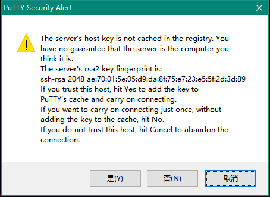

# linux初学者教程

Author:余信志

* [1.前言](#1)
  * [1.1教程目的](#1.1)
  * [1.2摆正心态](#1.2)
  * [1.3常见的linux发行版](#1.3)
* [2.通过SSH链接到linux服务器](#2)
  * [2.1什么是终端(命令行)](#2.1)
  * [2.2使用putty登录到远程linux服务器](#2.2)
* [3.Shell](#3)
  * [3.1什么是Shell](#3.1)
  * [3.2初步认识Shell](#3.2)
  * [3.3Bash shell 的一些功能与技巧](#3.3)
    * [3.3.1自动补全功能](#3.3.1)
    * [3.3.2使用通配符自动生成多个命令功能](#3.3.1)
    * [3.3.3任务前后台切换功能](#3.3.1)
    * [3.3.4其它功能](#3.3.1)
* [4.Linux之中的常识](#4)
  * [4.1一切皆文件](#4.1)
  * [4.2根目录下各目录的基本用途](#4.2)
  * [4.3基本的文件权限知识](#4.3)
  * 4.4基本的管道知识
  * 4.5基本的软件安装知识
    * 从软件源安装
    * 从源代码编译安装
  * 4.6其它零碎知识
* 5.linux最最常用的命令
* 6.安装LNMP(nignx+mysql+php)用于前后端开发
  * 6.1从一键安装脚本安装
  * 6.2手动安装所有组件并进行手动配置

<h2 id="1">1.前言</h2>
<h3 id="1.1">1.1教程目的</h3>
本教程的目标人群：从未接触过linux但是想要学会linux的一些基本操作以满足日常开发、使用需要的萌新，算是先让车跑起来吧。
所以本教程将会着重介绍一些常用到的知识与相关命令，但不太会深入去讲，但愿读者能自行谷歌查阅。

同时，建议读者在阅读本文时手头上有一台装着Linux的机器，建议租一台学生机，如[腾讯云](https://cloud.tencent.com/act/campus) [阿里云](https://promotion.aliyun.com/ntms/campus2017.html) (安装Ubuntu 16 系统即可)，也可使用[Windows Subsystem for Linux ](https://msdn.microsoft.com/en-us/commandline/wsl/install_guide) **使用wsl时请特别注意，linux子系统和windows不是完全隔离的，切勿尝试使用rm -rf / 等命令**

<h3 id="1.2">1.2摆正心态</h3>
可能很多人认为，linux只有呆板的黑底白字，是很难的，对用户一点都不友好。然而，实际上并不是这样。毕竟，linux也是人开发的，如果有使用不方便的地方，自然会有开发者去造轮子，尝试去让它变得更为易用，而且，linux已经有非常久的历史了，以往很多为了方便与机器交互而忽略人类使用体验的程序有了易用的替代品，例如 命令行操作界面的`bash shell`=>`zsh`, 命令行内的多窗口`screen`=>`Tmux`。同时，linux也是有图形操作界面，甚至比windows还要酷炫。有人可能要问，为啥有图形界面，我们还是要用命令行呢？因为，往往对用户越友好的东西，它的可扩展性越差，学完本教程之后，你会发现，通过`管道`这种东西，命令行的灵活度是图形界面完全不能达到的，例如，通过一系列的命令的简单组合，你可以立即从一堆纯文本的日记中找到你想要的信息，比如说每天第一个登录的用户，每天登录次数最多的用户等等。所以，请摆正你的心态，请勿带着一种畏惧的心态去学linux，linux是很有魅力，也是很好玩的。
<h3 id="1.3">1.3常见的linux发行版</h3>
什么是发行版：都是基于linux内核开发的系统，都有属于自己的生态，但是面向的使用场景不同。在笔者看来，就是系统自带的一套工具链不同。
下面仅列举笔者用过的linux发行版与在多年的玩鸡经验下对其的*主观*印象

* centos：Red hat的免费版本。red hat是一款面向企业的收费的linux系统，它主要的特点是自带的软件库版本非常稳定（毕竟充了钱），所以很多生产环境的服务器会用centos作为操作系统，但是软件库非常老....用起来很不舒服，笔者就不喜欢
* Debian: 非常常见的linux发行版，更新较为保守，比ubuntu省资源，一般用于服务器。笔者用于生产环境的服务器基本上用的都是debian
* Ubuntu: 感觉和Debian很类似，但是它是主要面向个人用户的，并且更新的非常激进，自带的软件库更新也很快，带有俩个分支，一个是desktop，一个是server。ubuntu的desktop版本相当于你用的windows系统，它的桌面是非常酷炫的，而且自带有非常多的日常使用的软件。server版本则主要用于服务器。笔者感觉ubuntu适合开发，笔者的开发服务器装的是ubuntu.

<h2 id="2">2.通过SSH链接到linux服务器</h2>

开始本节前手头上请务必有一台linux服务器

<h3 id="2.1">2.1什么是终端(命令行)</h3>

一般来说，我们所讲的linux终端是指用命令行形式和linux系统进行交互，也就是平常你看到别人操作linux时的那一个黑框框。那么问题来了，维护人员总不可能一直待在机器身边，那么如何远程去操作系统呢？这时候，就有Telnet(22端口)这种东西了，他是用来远程登录服务器的一种协议，但是他是明文的，非常不安全。之后便出了一种协议，叫ssh (Secure Shell) ，它是一项创建在应用层和传输层基础上的安全协议，加密了传输的内容。一般来说，我们在讲ssh时，一般是指使用ssh(23端口)连接到linux服务器，当然了，ssh是可以用来加密传输其它内容的。就目前而言，读者可认为ssh指的是通过一种安全的姿势去连接远程linux服务器。

<h3 id="2.2">2.2使用putty登录到远程linux服务器</h3>

Putty 是一款功能强大的终端连接工具(但是界面简陋)，在windows上本教程使用它来连接linux服务器 下载地址：[putty](https://www.chiark.greenend.org.uk/~sgtatham/putty/latest.html)  当然也有其它更好用的软件，如 `xshell` 但是本文还是建议读者先使用Putty

用linux的dalao可以直接打开终端输入 `ssh 用户名@ip` 进行登录


这是打开putty后的界面，左边是一堆设置，右边是连接信息。Host Name处就是你linux服务器的ip地址，填入后直接点open即可



随后你可能看到这样的一个框。由于ssh是基于rsa加密进行传输的，而在首次通信前我们和服务器都不知道对方的公钥是啥，这个框就告诉你服务器提供的公钥的指纹，供你进行确认，一般来说，我们信任即可，所以点是，之后软件会把这个公钥存下来，如果下次连接时和这个是一样的，则自动信任了。*如果之后链接弹出个框告诉你服务器提供的公钥和缓存里的公钥不一致，你就要当心是否有人劫持了你到服务器的流量了(中间人攻击)。*

之后则进入了终端环境。服务器会先要求你进行身份认证，就相当于你开电脑输入账号密码才能系统啦23333


 `login as:` 意思是提醒你输入要登录的用户名，这时候请查询开通云服务器后服务商给你发的信息了，里面会包括默认用户名和密码（或是在创建时已设定）。在以往一般是提供`root`账号(root 账号你可以理解为是linux系统里的超级管理员，拥有最高的权限，但是直接使用这个账号进行操作是十分危险的)，现在一般是提供一个普通使用者身份的账号给你，然后通过`sudo`来执行需要`root`账户执行的命令

ubuntu系统一般给的是`ubuntu`

输入`ubuntu` 回车


接下来是要求输入密码了，将密码填入，回车即可(*注意密码输入时并不会显示出来*)

*Tips:在putty中复制粘贴操作有点不同：粘贴请直接按一下右键，复制请用左键选择要复制的文字即可*

如果顺利的话，你会看到Welcome to Ubuntu 这就说明我们已经成功登录进服务器了！那么，我们就hello world一下吧~

粘贴代码

 ` sudo apt-get install screenfetch -y && clear && screenfetch` 

回车（如果要求输入密码再把密码输一遍）


呐，多可爱~

上面这条命令呢，其实是三个部分。先是装了一个软件，然后清空了当前终端显示，再执行这个软件，具体呢~看下文啦

<h2 id="3">3.Shell</h2>
<h3 id="3.1">3.1什么是Shell</h3>

> 在计算机科学中，shell指“为用户提供用户界面”的软件 (via [wiki)](https://zh.wikipedia.org/zh-cn/%E6%AE%BC%E5%B1%A4)

简单来说，就是介于用户和程序(系统)之间的软件，负责将用户的意思传达给系统。

在linux中，有多种linux shell。默认自带的是 `bash shell` 那我们就来讲讲`bash shell`吧

其实，在你登入系统开始，就是在和`bash shell`打交道了

<h3 id="3.2">3.2初步认识Shell</h3>

在登录进终端后，你会发现最下面一行显示的是

`root@iZpbydu9r6au0hZ:~#`

`root`指的是你当前登录的身份是root，然后在@后面到:的则是当前登录的服务器的主机名(你可以理解为你给这台计算机起的名字) 而:到#之间的则是当前所处的目录

> ~是个特殊的目录，表示你在该用户的主目录下，对于root用户来讲，实际上是`/root`，对于其它用户，指的是`/home/用户名`。需要注意的是，~只是一个符号，你也可以通过`cd ~`快速地将当前目录切换到你的用户目录下


<h3 id="3.3">3.3Bash shell 的一些功能与技巧</h3>

 #### 自动补全功能

它提供了一定的自动补全功能，例如在输入命令和文件路径的时候。具体是通过按`Tab`键来使用这个功能。

例如：

* 我想使用`poweroff`这个命令，那我只需输入前几个字母，例如`pow`，之后按一下tab键，它就会自动帮你补全成`poweroff`
* 我想读取`/etc/debian_version`这个文件，那我在输入`cat`这个用来读取文件的命令后，输入这个路径的一部分，如`cat /etc/debian` ，再按下tab键，就会自动补全成`cat /etc/debian_version`(当然了，如果这个文件在很深的目录里，在每一层目录中输入下一目录的某一部分，也是可以补全目录名的)

有时候，可能按一下tab键没有反应，有俩种可能，一是没有匹配，而是有多种匹配。这时候再按一次tab就可把可能的匹配列出来

 #### 使用通配符自动生成多个命令功能

例如，在当前目录下，有a-1.txt a-2.txt a-3.txt a-4.txt，我想一次性将这些文件都读取出来，那么只需输入

 `cat a-*.txt`

Bash shell 将会自动匹配符合格式的文件名，然后对应每个文件都执行一次相应的命令

#### 任务前后台切换功能

*阅读本节内容前可能要先阅读后面内容*

设想一种情景，你正在终端里下载一个文件，但是在下载期间，你又想干其他事，这时候就可以借助这个功能，将下载任务切换到后台，然后就可以执行另一个操作了。

##### 在任务开始执行时就放到后台执行

这时候只需简单的在命令最后面加上 `&` 即可，回车后程序将会在后台执行

```shell
yxz@YXZ-LAPTOP:/home$ ping -c 4 hemc.100steps.net > /dev/null &
[1] 16
yxz@YXZ-LAPTOP:/home$
[1]+  Done                    ping -c 4 hemc.100steps.net > /dev/null
yxz@YXZ-LAPTOP:/home$
```

在执行命令后，首先会显示 `[1] 16` 这表示该任务的`jobid`为1，并且刚刚执行的任务的进程ID（PID）为16.

在任务完成后，bash shell会在适当的时候显示 `[1]+  Done` ,表示任务1已完成。具体是什么时候会显示呢。emmmm大概就是你在每次按下enter后吧（

那么问题来了，执行的程序的输出去了哪了呢？这里为了演示方便，将输出全部丢弃了，即使用`>`控制输出到`/dev/null`，目前你可以认为这个文件是个无底洞，什么东西都可以往里面倒。具体文件系统与输入输出控制方面将会在后文说明。

如果没有重定向输出，输出将会直接输出到了终端上，这样就干扰了你的视线，不方便执行接下来的操作了。

比如下面这样：

```shell
yxz@YXZ-LAPTOP:/home$ ping -c 4 hemc.100steps.net  &
[1] 21
yxz@YXZ-LAPTOP:/home$ PING hemc.100steps.net (222.201.132.*) 56(84) bytes of data.
64 bytes from 222.201.132.*: icmp_seq=1 ttl=58 time=2.32 ms
64 bytes from 222.201.132.*: icmp_seq=2 ttl=58 time=1.84 ms
64 bytes from 222.201.132.*: icmp_seq=3 ttl=58 time=1.79 ms
64 bytes from 222.201.132.*: icmp_seq=4 ttl=58 time=1.68 ms

--- hemc.100steps.net ping statistics ---
4 packets transmitted, 4 received, 0% packet loss, time 3001ms
rtt min/avg/max/mdev = 1.683/1.913/2.329/0.248 ms

[1]+  Done                    ping -c 4 hemc.100steps.net
yxz@YXZ-LAPTOP:/home$
```

##### 在任务执行中扔到后台执行

设想一个场景，我们正在编辑一个文件，突然要查找什么，这时候就可以将它切换到后台。

当前目录为`/home` 我们要编辑该目录下的`log.txt`

输入 `nano log.txt`


*咦，怎么一堆bug（逃*

这时候就进入了`nano`这个文本编辑器的界面（nano是较为简单的文本编辑器，下面是菜单栏，`^`表示该命令是要按着ctrl执行的，比如要退出就按着`ctrl + x`，还有其它文本编辑器如`vim`，它的上手门槛较为高*你甚至不知道怎么退出它*，但是上手后是非常非常好用的，有兴趣的读者可以自行了解）

这时候，我们按下`ctrl+z` (任意程序下都可以)就可以将当前任务切换到后台并 **暂停** 其运行

```shell
yxz@YXZ-LAPTOP:/home$ nano log.txt
Use "fg" to return to nano.

[1]+  Stopped                 nano log.txt
yxz@YXZ-LAPTOP:/home$
```

这时候，它就提示该任务的id为1并且状态为暂停。这时候我们可以去执行另外的命令了，比如我现在就要去查bug，就`cat /mnt/d/workspace/SCUT-ACM-Training-System/Slimvc/Config.php | more `

要注意的是，这个任务是处于暂停状态。如果想要他在后台保持执行，就输入 `bg 1` 表示让jobid为1的任务恢复运行并保持在后台。

好了，做完其他事了，我们要回去了。这时候输入`fg 1`即可回到jobid为1的任务并让他切换到前台。

另外，在执行某个程序时，你突然想强制结束他，很简单，按下`ctrl+c`即可，该命令会给程序发送一个终止信号

##### ssh连接时要注意的事

如果你是通过ssh连接上去，然后将某个任务放到了后台，并且希望关掉ssh时它仍然在执行，那么退出时就不要直接点软件的`X`了，请在终端中输入`exit`来退出

#### 其它功能

bash shell中还有一定的编程能力，也就是脚本，或者说相当于windows上的批处理。有兴趣的读者可以前往 [鸟哥的Linux私房菜之Bash shell](http://cn.linux.vbird.org/linux_basic/0320bash.php)进行学习，本文主要是为了快速入门，这里就不讲了。

<h2 id="4">4.Linux中的常识</h2>

<h3 id="4.1">4.1一切皆文件</h3>

在windows中，给你最直观的感受就是，每个硬盘/分区是映射到某个盘符下的(一般来说)，所以就分成了C/D/E盘。然而，在linux下则完全不同，linux下是没有盘符这种东西的，linux下只有一个根目录，也就是 `/` ，所有分区都是通过一种叫做`挂载`的操作将其挂载到某个目录下。

```shell
root@iZpbydu9r6au0hZ:~# tree -L 1 /
/
├── bin
├── boot
├── dev
├── etc
├── home
├── initrd.img -> boot/initrd.img-4.4.0-63-generic
├── initrd.img.old -> boot/initrd.img-4.4.0-31-generic
├── lib
├── lib64
├── lost+found
├── media
├── mnt
├── opt
├── proc
├── root
├── run
├── sbin
├── srv
├── sys
├── tmp
├── usr
├── var
├── vmlinuz -> boot/vmlinuz-4.4.0-63-generic
└── vmlinuz.old -> boot/vmlinuz-4.4.0-31-generic

20 directories, 4 files
root@iZpbydu9r6au0hZ:~# 

```

上面是根目录`/`下的文件结构

同时，linux中有一种思想，叫做一切皆为文件。linux里的一切东西，包括进程信息、硬件设备，甚至一些系统的接口，都是以某个文件的形式存在。例如说，你的硬盘，是以一个文件的形式存在于`/dev/`目录下的。

例如，在笔者的腾讯云服务器上

```shell
ubuntu@VM-9-236-ubuntu:~$ ls -allh /dev/vd*
brw-rw---- 1 root disk 253,  0 May 17  2016 /dev/vda
brw-rw---- 1 root disk 253,  1 May 17  2016 /dev/vda1
brw-rw---- 1 root disk 253, 16 May 17  2016 /dev/vdb
brw-rw---- 1 root disk 253, 17 May 17  2016 /dev/vdb1
brw-rw---- 1 root disk 253, 32 May 17  2016 /dev/vdc
ubuntu@VM-9-236-ubuntu:~$ 

```

第一个硬盘是`/dev/vda` 同时，他的第一个分区为`/dev/vda1`

第二个硬盘是`/dev/vdb`同时，他的第一个分区为`/dev/vdb1`

那么问题来了，既然他是文件，我们能对它进行读写操作吗？

当然是可以的！你可以直接对`/dev/vda`进行读写，就相当于直接对硬盘进行操作，绕过了文件系统。但是 **请不要这样做** 例如，你想对某个硬盘进行低格处理，也就是全部填零，只需要执行 `dd if=/dev/zero of=/dev/硬盘设备名`

那么，我们来看看系统里哪些目录是挂载的

```shell
ubuntu@VM-9-236-ubuntu:~$ mount -l
/dev/vda1 on / type ext3 (rw,noatime,acl,user_xattr)
/dev/vdb1 on /home type ext3 (rw)
proc on /proc type proc (rw)
sysfs on /sys type sysfs (rw)
none on /sys/fs/cgroup type tmpfs (rw)
none on /sys/fs/fuse/connections type fusectl (rw)
none on /sys/kernel/security type securityfs (rw)
udev on /dev type devtmpfs (rw,mode=0755)
devpts on /dev/pts type devpts (rw,mode=0620,gid=5)
tmpfs on /run type tmpfs (rw,noexec,nosuid,size=10%,mode=0755)
none on /run/lock type tmpfs (rw,noexec,nosuid,nodev,size=5242880)
none on /run/shm type tmpfs (rw,nosuid,nodev)
none on /run/user type tmpfs (rw,noexec,nosuid,nodev,size=104857600,mode=0755)
none on /sys/fs/pstore type pstore (rw)
systemd on /sys/fs/cgroup/systemd type cgroup (rw,noexec,nosuid,nodev,none,name=systemd)
/tmp/mysql-5.5.40.sock on /home/wwwroot/lamp/domain/喵喵喵/tmp/mysql-5.5.40.sock type none (rw,bind)
ubuntu@VM-9-236-ubuntu:~$ 
```

可以看到，第一个硬盘的第一个分区`/dev/vda1`挂载到了`/`，即根目录下，并且他的文件系统类型是`ext3`(可类比于`ntfs`)

第二个硬盘的第一个分区`/dev/vdb1`挂载到了`/home`目录下。

所以，我们往`/`目录中进行文件操作，实际上操作的是`/dev/vda1`里的内容，`/home`中的内容，即是`/dev/vdb1`

当然，并不是只有硬盘才能挂载到某个目录下，一个文件，一段内存，甚至是远程服务器上的某个目录，都可以挂载到本地的某个目录上。

另外，在`/dev`下有一些有趣的东西，例如 `stdout` `stderr` 。学过一点c++同学都知道，你在`cout`一个东西的时候，实际上是往`stdout`上写东西，也就是最终显示在黑框框内。那我们来试试往里面写东西会发生什么？

```shell
ubuntu@VM-9-236-ubuntu:~$ echo "23333" > /dev/stdout 
23333
ubuntu@VM-9-236-ubuntu:~$ 
```

咦，显示到终端上了耶。这时候，是否开始有点感觉了呢？

另外，还有`/dev/zero`这个文件是用来提供无限个0的，还有`/dev/random`这个是用来读取随机数的。

而前文提到的 `/dev/null` 则是一个无底洞，可以往里面写任何东西，但不会有任何副作用。

接下来，我们到 `/proc/`目录下看看。这个目录提供了内核内部数据结构以及改变内核设置，还可查看一些进程信息

例如，我们可以通过`cpuinfo`以及`meminfo`这俩个文件查看服务器的处理器和内存信息

```shell
root@iZpbydu9r6au0hZ:~# cat /proc/cpuinfo 
processor	: 0
vendor_id	: GenuineIntel
cpu family	: 6
model		: 62
model name	: Intel(R) Xeon(R) CPU E5-2650 v2 @ 2.60GHz
stepping	: 4
microcode	: 0x428
cpu MHz		: 2600.084
cache size	: 20480 KB
...

root@iZpbydu9r6au0hZ:~# cat /proc/meminfo 
MemTotal:        2046560 kB
MemFree:           54984 kB
MemAvailable:    1151888 kB
...

```

<h3 id="4.2">4.2根目录下各目录的基本用途</h3>

```shell
root@iZpbydu9r6au0hZ:~# tree -L 1 /
/
├── bin 二进制可执行文件
├── boot
├── dev 设备特殊文件
├── etc 各种软件以及系统的配置文件
├── home 各用户主目录存放于此
├── initrd.img -> boot/initrd.img-4.4.0-63-generic
├── initrd.img.old -> boot/initrd.img-4.4.0-31-generic
├── lib 库
├── lib64 库
├── lost+found
├── media 印象中cdrom会挂载到这里面吧
├── mnt 系统提供这个目录是让用户临时挂载其他的文件系统于此。例如插入的u盘等
├── opt
├── proc 虚拟的目录，是系统内存的映射。可直接访问这个目录来获取系统信息
├── root root用户的主目录
├── run
├── sbin
├── srv
├── sys
├── tmp 用于存放临时文件的目录
├── usr 按照惯例，各种安装的程序都在此目录下
├── var 如各种服务的日志文件
├── vmlinuz -> boot/vmlinuz-4.4.0-63-generic
└── vmlinuz.old -> boot/vmlinuz-4.4.0-31-generic

20 directories, 4 files
root@iZpbydu9r6au0hZ:~# 
```

<h3 id="4.3">4.3基本的文件权限知识</h3>

设想一种场景。在linux里，`/etc/shadow`文件是用于存储所有用户的账号密码的 。小民有某台服务器的普通用户账号`ubuntu`，有一天他想删掉数据库，但是需要是`root`身份，他心生邪念，想看看root用户的密码是啥

```shell
ubuntu@VM-9-236-ubuntu:~$ cat /etc/shadow
cat: /etc/shadow: Permission denied
ubuntu@VM-9-236-ubuntu:~$ 
```

非常幸运的是，文件权限管理系统阻止了他的这种行为。

那么，文件权限管理系统是怎么工作的呢？

在linux系统中，每个文件及目录都有它对应的权限。分三类 `文件所有者 文件所有组 全局` 同时，每一类下细分了三种操作 分别是`r(读) w(写) x(运行)`。

我们来看看某个文件的权限属性

```shell
ubuntu@VM-9-236-ubuntu:~$ ls -allh /etc/hosts
-rw-r--r-- 1 root root 131 Jul 14 10:11 /etc/hosts
```

首先，我们关注下`-rw-r--r--` 这个就代表了基本的文件权限。第一位就先不管啦，后面的每三位分别代表着对应的`文件所有者 文件所有组 全局`。在这三位里，你可以看到`r w x`对应着读写运行。

*执行权限指的是可以 **直接** 通过 ./文件名 来运行这个文件*

后面的`root root` 第一个是指文件所有者是root用户，第二个是指文件所有组是root用户组

所以，我们可以清晰的了解到，

root用户拥有该文件的 读 写 但无执行权限。

root用户组仅拥有文件的读权限

其它所有用户仅有读权限。

例如，`ubuntu`用户就属于其它用户了，他只能读这个文件，却不能往里面写任何东西。

又如用户`yxz`属于root用户组，那么他对应的权限是第4-6位`r--`，只有读权限

而目录也是有权限的，也是`r w x`，但是意义确不大相同。

r:目录的内容可以被读取(即目录下有什么文件)

w:目录下可以进行创建文件、更改文件名、删除等操作 *注意如果没有x权限，w权限没有作用*

x:表示该目录可以被访问，即通过`cd`将当前目录更改到该目录。需要注意的是，如果要cd到某个目录，用户必须拥有该目录的父目录祖父目录等等等的x权限

那么，我们如何改变某个文件的目录呢？

我们首先创建一个`test`目录到`/tmp`目录下进行实验

```shell
ubuntu@VM-9-236-ubuntu:~$ cd /tmp
ubuntu@VM-9-236-ubuntu:/tmp$ touch test
ubuntu@VM-9-236-ubuntu:/tmp$ ls -allh test
-rw-rw-r-- 1 ubuntu ubuntu 0 Oct  7 19:57 test
```

我们可以看到，该文件的默认权限是`rw-rw-r--`，当然这个默认配置是可以进行修改的。

改变权限用的是`chmod`这个命令，首先要求的是你是这个文件的拥有者。

比如，我们想让自己能执行这个文件

```shell
ubuntu@VM-9-236-ubuntu:/tmp$ chmod u+x test 
ubuntu@VM-9-236-ubuntu:/tmp$ ls -allh test 
-rwxrw-r-- 1 ubuntu ubuntu 0 Oct  7 19:57 test
```

(这里的u指的是所有者，此外，用户组是g，其他人是o，三个一起来则是a)

现在我们可以看到，已经加上执行权限了

那我们来去掉写权限

```shell
ubuntu@VM-9-236-ubuntu:/tmp$ chmod u-w test 
ubuntu@VM-9-236-ubuntu:/tmp$ ls -allh test 
-r-xrw-r-- 1 ubuntu ubuntu 0 Oct  7 19:57 test
```

实际上，在使用时，可能会更偏向于使用数字的形式来进行权限的设置。

对于当前的`/tmp/test`文件，它权限对应的数字是 `564`

这个数字是怎么来的呢？实际上，它使用的是一种类似于置位的方法。

对于每一组权限，可以看作是由一个三位的二进制数组成的。这个二进制数的第一位表示读，第二位是写，第三位是执行。

```
每一位对应如下：
1 1 1
r w x
对于r-w 则为
1 0 1
r - w
转化为十进制数刚好是`5`
```

那么，我们来用数字的形式设置一下权限

```bash
ubuntu@VM-9-236-ubuntu:/tmp$ chmod 564 test
ubuntu@VM-9-236-ubuntu:/tmp$ ls -allh test 
-r-xrw-r-- 1 ubuntu ubuntu 0 Oct  7 19:57 test
```

*若想看chmod的其它用法，请自行谷歌*

*若想改变文件的所有者，请参阅 chown*

想要深入了解，可以看一下 [鸟哥的linux私房菜](http://cn.linux.vbird.org/linux_basic/0210filepermission.php)

//todo.....